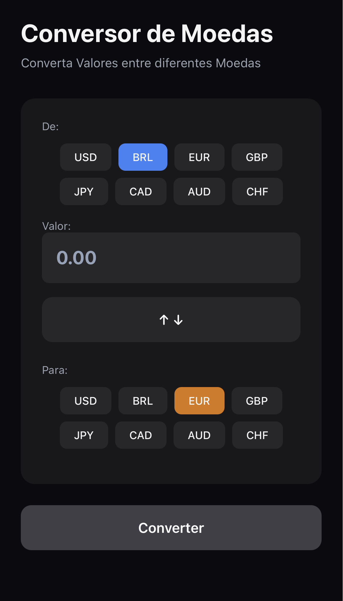

# Conversor de Moedas

Um aplicativo móvel simples que permite converter valores entre diferentes moedas em tempo real, usando taxas atualizadas.

## Tecnologias
- React Native
- Expo
- JavaScript

## Funcionalidades
- Conversão de moedas em tempo real
- Interface amigável e responsiva
- Suporte a múltiplas moedas
- Histórico de conversões (opcional)

## Autor
Gabriel Martin 

